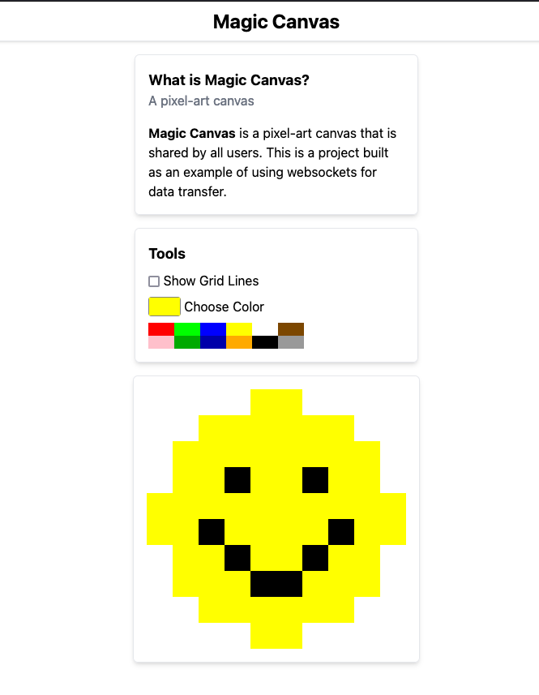

# Magic Canvas!

A live shared canvas for multiple users to draw on! This was a project to work with websockets, as well as experience with HTMX-powered applications. The goal for this application was to make an app with some user interaction without having to write any JavaScript code to build a frontend for the app. THanks to a few important pieces of technology (see section below), I was able to achieve this no-JS application with live updates to the canvas for all users! 

## Check it out
Check out the app live at [https://canvas.corydio.com/](https://canvas.corydio.com/).

Open multiple tabs, browsers, or try it on multiple devices & the canvas will sync across all of them.



## Technology
This application is a simple Go webserver that servers HTML content. The content is built via [templ](https://templ.guide/), a powerful component-based templating library for Go. The server is powered by [fiber](https://docs.gofiber.io/), a web framework for Go. 

To style the components, I make use of [tailwindcss](https://tailwindcss.com/). Tailwind runs during the build step for the app to build a stylesheet based on the classes I have used in the `*.templ` files, and places it in the static directory. 

The magic of the no-JS goal comes from two small libraries, [htmx](https://htmx.org/) and [Alpine.JS](https://alpinejs.dev/). Htmx is a small JS library that enables code for AJAX requests & more just using HTML attributes. Alpine.JS is a small & lightweight JavaScript framework that can be used entirely with HTML attributes. Technically I did have to write a couple 1-line JavaScript expressions for Alpine to set assign a state variable. However they are all inline within attributes, so I'm not going to count them! 🙂

The synchronization of the canvas across each user/tab/page on the site is powered by websockets. It is a pretty basic implementation, where it sends a new HTML fragment for the updated "pixel" on the canvas, and htmx updates the correct element based on the id. 

## Getting Started

These instructions will get you a copy of the project up and running on your local machine for development and testing purposes. See deployment for notes on how to deploy the project on a live system.

## MakeFile

install dependencies
```bash
make install
```

build the application
```bash
make build
```

run the application
```bash
make run
```

live reload the application
```bash
make watch
```

run the test suite
```bash
make test
```

clean up binary from the last build
```bash
make clean
```
